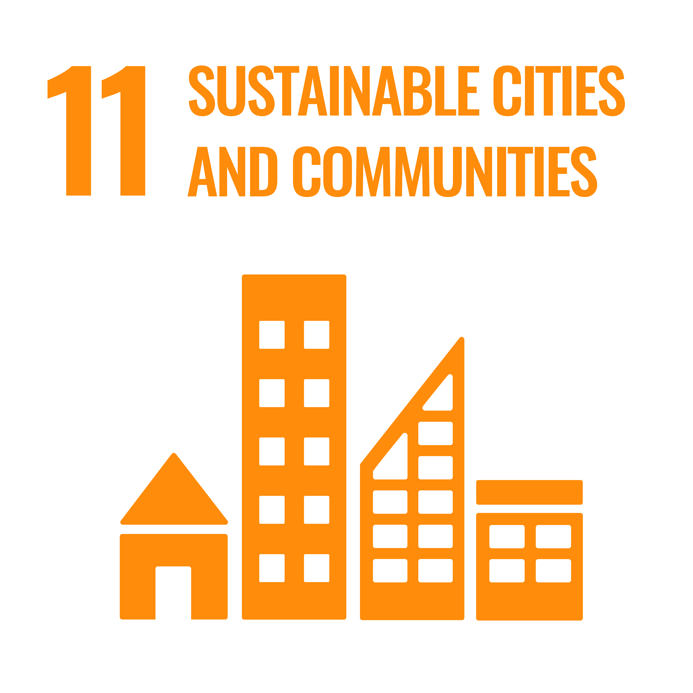

# 🌍 design_graph: Interactive Climate Visualization Redesign

This repository contains the final implementation of **"Feeling the Heat: An Interactive Redesign of Global Climate Visualization"**, a course project for **INFOSCI 301 – Data Visualization and Information Aesthetics** at Duke Kunshan University.

## 📌 Project Overview

This project redesigns a static choropleth map of projected Cooling Degree Days (CDD) to enhance **emotional resonance**, **analytical clarity**, and **interactive exploration**. Inspired by foundational visualization theory (Munzner, 2014), affective design frameworks (Lan et al., 2023), and interactive climate visual principles (Mahyar, 2024), this redesign visualizes country-level temperature trends over time using open-source climate data and custom visual encodings.

In response to feedback from **Prof. Binbin Li**, an additional component was added to localize climate storytelling: a **monthly temperature time series for New York City (1869–2022)**. Prof. Li emphasized the importance of allowing users to reflect on familiar places and experiences over time to foster empathy and patience in the face of climate uncertainty. This inspired a more grounded, personal view of climate change.

## 📊 Features

- 🗺️ **Global Map**: Dynamic choropleth map (country-level, 1900–2013)
- 🎨 **Color Design**: Custom color scale (bone white → orange → flaming purple) to evoke climate urgency
- 📆 **Time Slider**: Animated timeline to explore temperature change by year
- 🖱️ **Tooltips**: Hover-enabled country, year, temperature, and key events
- 📌 **Narrative Tags**: e.g., 2003 European heatwave, 2010 Russian heatwave
- 🌆 **City-Level Storytelling**: NYC temperature trends visualized over 150+ years

## 🛠️ Tools & Technologies

- [Python (Google Colab)](https://colab.research.google.com/)
- [Plotly](https://plotly.com/python/)
- [Pandas](https://pandas.pydata.org/)

## 📁 Files

| Filename | Description |
|----------|-------------|
| `Redesign_visualization.ipynb` | Final notebook with global + NYC visualizations |
| `GlobalLandTemperaturesByCountry.csv` | Dataset from [Berkeley Earth on Kaggle](https://www.kaggle.com/datasets/berkeleyearth/climate-change-earth-surface-temperature-data) |
| `NYC_Central_Park_weather_1869-2022.csv` | Dataset from [Dan Braswell on Kaggle](https://www.kaggle.com/datasets/danbraswell/new-york-city-weather-18692022) |
| `README.md` | Project documentation |

## 🔗 Links

- 🌍 [Global Climate Dataset – Berkeley Earth](https://www.kaggle.com/datasets/berkeleyearth/climate-change-earth-surface-temperature-data)
- 🌆 [NYC Weather Dataset – Central Park (1869–2022)](https://www.kaggle.com/datasets/danbraswell/new-york-city-weather-18692022)
- 📊 Visualization notebook: Viewable in Google Colab
- 📑 Full academic report & poster available upon request

## ✅ Disclaimer

Course project for **INFOSCI 301 – Data Visualization and Information Aesthetics**, instructed by **Prof. Luyao Zhang** at **Duke Kunshan University**, Spring 2025.

## 🌍 Contribution to Sustainable Development Goals (SDGs)

This project aligns with the following Sustainable Development Goals:

- **Goal 13: Climate Action**  
  By visualizing long-term global and localized temperature trends through emotionally engaging and interactive designs, the project raises awareness about climate change and promotes urgent action toward environmental sustainability.

- **Goal 4: Quality Education**  
  By enhancing the emotional accessibility and user engagement of complex climate data, the project supports education initiatives aimed at fostering a deeper public understanding of environmental issues.

- **Goal 11: Sustainable Cities and Communities**  
  By integrating localized data narratives, such as the New York City temperature timeline, the project encourages reflection on how climate change impacts local communities, supporting awareness and action toward sustainable urban development.

### SDG Logos

## 🔍 Future Research Direction on Digital Humanities

During the field trip to the *Mystery of Life Museum* in Zhouzhuang, I was inspired by an exhibit where two plastinated human specimens—one muscular, one skeletal—were displayed holding hands in a joyful posture (see Figure below). 

This curatorial choice demonstrated how emotional framing can transform perceptions, shifting from fear toward curiosity and empathy. In future visualization work, especially in climate communication, I plan to emphasize positive motivation—highlighting resilience, community, and hope—rather than fear-based messaging. Research suggests that empowering emotional framing is more likely to foster sustained engagement and personal agency.

### Field Trip Photo

## 🙏 Acknowledgments

Thanks to Prof. Zhang for instructional support, and to all peers whose feedback helped shape this project. And also thanks guest speakers David Schaaf and Dongping Liu for their inspiring insights on immersive education and real-world visualization applications. And special thanks to **Prof. Binbin Li (Environmental Science, DKU)** for her insights on the emotional power of local context and the importance of patience and open-ended reflection in climate communication.
